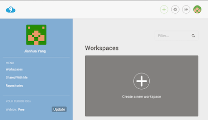
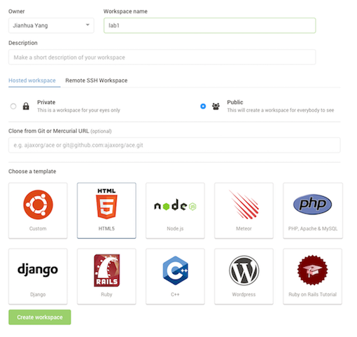
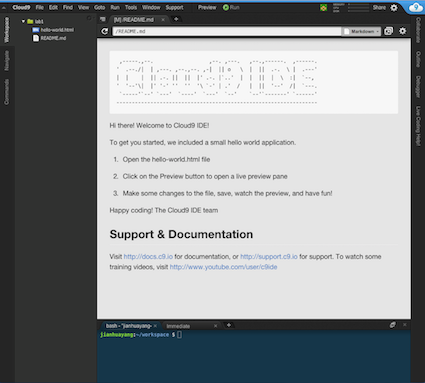
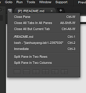
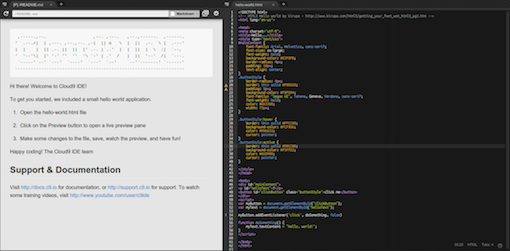
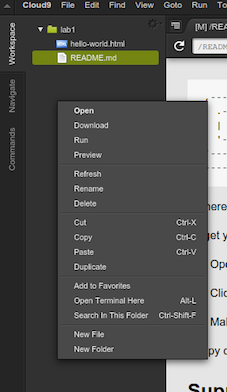
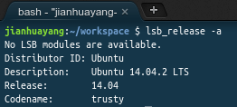

# The Cloud9 IDE

Nowadays everything is on the cloud. This includes your integrated development environment (IDE). In this module we'll use [Cloud9](https://c9.io/) as our platform to learn web development. Compared with traditional IDEs such as [Aptana Studio](http://www.aptana.com/) cloud-based tools such as C9 offers the following advantages, among many others:

* Minimized maintenance efforts.
* Better access your code, virtually from everywhere.
* Easier to share and collaborate.

> As a programmer we don't normally share photos like most others do, we share codes instead. This is because [talk is cheap, show me the code](https://en.wikipedia.org/wiki/Linus_Torvalds).

But the drawback is obvious -- you need to be connected. So my advice is KEEP BACKING UP!

## Setting up C9

### Create (and delete) a workspace

Visit https://c9.io and create an account if you haven't got one. After signing in you should see something similar to this



This is called the Dashboard, and it's where different workspaces (projects) are being managed. Click on the plus sign to create a new workspace and name it lab1. Select HTML5 as the template and click Create workspace



This will bring you to something similar to below



Congratulations! You've just created your first project in C9! Notice the littller cloud icon to the right hand side of the IDE, click on it will bring you back to the Dashborad.


What you'll see now is that a new workspace called lab1 appeared in your Dashborad. Click anywhere within lab1's rectangle frame, but not the Open button, this is take you to the Workspace overview page


This is where you can find out how much diskspace and RAM are being used in your project, and what files you have etc. If you exceed the limit for a free acount, you'll have to pay!

Click on the little green gear icon will take you to the settings page, this is where the whole project can be deleted (for ever). So be careful with this.


Now click on the green Open icon to go back to the IDE itself.

### C9 guided tour

The IDE can be roughly devided into 4 areas:

1. The horizontal menu bar.
2. The left/right tools window.
3. The main editor window in the middle.
4. The Console window at the bottom.

The visibility of these winodws can be toggled using View dropdown menu. 

There're two useful fucntions you need to know:

1. Press F6 to toggle the Console window. If you think the Console is useless (it's not) you can hide it by pressing F6. For a full list of keyboard shortcuts, click [here](https://docs.c9.io/docs/keybindings).
2. The editor screen can be split, either horizontally or vertically, by clicking View ==> Layout ==> Split. As an alternative, you can click the small 'right click' icon to the top left corner of the editor window.





By default the Workspace tool window is open to the left. This is where you create and rename files/folders. It also supports right click etc. Drag and drop is also possible, but only within the workspace and not between C9 and your computer (at least not on free accounts).



Now click on the Commands tool window to bring it up. This Commands tool windows provides many useful commands (shortcuts) to everyday operations. For example, in the textbox type in hsplit and hit enter. Now you see the editor window split again. 


To the right hand side of the menu bar, you see the 'Share' and configure icons. This is where you share your code with me to get help if you get stuck one day (please don't). There's also an overview of how much CPU/disk space etc. are being used. This allows you to monitor your virtual machine (we'll come back to that later).


### Preview your website

Traditionally if you want to build a website and see how other people see it, you'll need to install different versions of browsers. Now with technologies like C9, we can save time in setting up things like broswers on your own computer.

Double click the automatically generated file hello-world.html to view it in the editor. Don't worry about the actual code. Now right click that file in Workspace tool window and select Preview. What you'll see is the file is being rendered in a browser window.


Click on the Browser button to switch to a different browser to see what your webpage looks like in a different browser.


Right click on file hello-world.html and select Run. This will open a new Console window similar to the one below:


Copy that url and paste into the browser window, now you'll see the same content as before. The URL for my webpage is at

```sh
    https://lab1-jianhuayang.c9users.io/hello-world.html
```

We have now used two ways to view an html file:

1. Preview shows you what your webpage looks like in a static manner. That is the same as you open an html file using your browserss File ==> Open.. senario.
2. Run determines what you have in the html first of all (and execute if necessary), and then serve it through a web server. If you website work with data, as we'll do later in the module, you'll need to run it through a web server.

> For more info on webpages and webiste, click this link from Mozilla [Webpages, websites, web servers, and search engines](https://developer.mozilla.org/en-US/Learn/Pages_sites_servers_and_search_engines).

## Basic Linux commands

Behind the scene C9 is based on Linux technology and specifically it's Ubuntu 14.04 at the time of writing (Jan 2016). This can be verified if you issue the following command in the terminal window:

```sh
    lsb_release -a
```

The output is 



Basically what happens when you create a Workspace in C9 is that the system creates a virtual machine for you using Ubuntu 14.04 with the configuration of 5GB disks etc. You need to know some basic comand line operations if you work with C9 or web technologies in general.

> Other popular Linux OSs include Fedora and openSUSE. For a comprehensive list, click [Put the fun back into computing](http://distrowatch.com).

### Navigate the filesystem

The Console window (also called terminal or shell) is a way we interact with the virtual machine that hosts our workspace. And probably it's the most effective way. 

> They say that [Jeff Dean](https://en.wikipedia.org/wiki/Jeff_Dean_(computer_scientist)) uses just two keys '0' and '1' to talk to the console, which is probably not true. See [here](https://www.quora.com/What-are-all-the-Jeff-Dean-facts).


What we have seen in the Workspace is that the HTML template generated two files for us: hello-world.html and README.md. But in fact what has been created is a whole systems: an operating system, a web server, your home folder, and many others.

Use the following command to see where you are in the system (pwd = print working directory)

```sh
    jianhuayang:~/workspace $ pwd
    /home/ubuntu/workspace
```

To see what files we have here

```sh
    jianhuayang:~/workspace $ ls
    README.md*  hello-world.html
```

The `ls` command can have differnt options in the form `ls -a -l` or `ls -al`. Here option `-a` tells the system to show hidden files/folders, and `-l` is the flag for long listing format. In the outputs, the single dot `.` represent the current directory and the double dot `..` represents the parent directory. Names that begin with a period `.` are hidden files/folders, which don’t normally show up. 

```sh
    jianhuayang:~/workspace $ ls -al
    total 20
    drwxrwxr-x  3 ubuntu ubuntu 4096 Jan 13 11:11 ./
    drwxr-xr-x 19 ubuntu ubuntu 4096 Jan 13 23:23 ../
    drwxr-xr-x  3 ubuntu ubuntu 4096 Jan 13 11:11 .c9/
    -rwxrwxr-x  1 ubuntu ubuntu  907 Oct 12 13:14 README.md*
    -rw-rw-r--  1 ubuntu ubuntu 1272 Oct 12 13:14 hello-world.html
```

Use the follwing command to navigate to the .c9 folder and see what's in there

```sh
    jianhuayang:~/workspace $ cd .c9/
    jianhuayang:~/workspace/.c9 $ ls -a -l
    total 20
    drwxr-xr-x 3 ubuntu ubuntu 4096 Jan 13 11:11 ./
    drwxrwxr-x 3 ubuntu ubuntu 4096 Jan 13 11:11 ../
    -rw-r--r-- 1 ubuntu ubuntu  116 Jan 13 11:11 .nakignore
    drwxr-xr-x 5 ubuntu ubuntu 4096 Jan 13 23:23 metadata/
    -rw-r--r-- 1 ubuntu ubuntu  974 Jan 13 22:55 project.settings
```

> By default, the command prompt changes if you change current directory.

Use the following command to navigate to the root of the file system

```
jianhuayang:~/workspace/.c9 $ cd ../../../../
jianhuayang:/ $ pwd
/
```

Now we're at the root of the file system. If you issue `ls` command again you'll see different folders in the system

```sh
    jianhuayang:/ $ ls
    bin/   build/  dev/  home/  lib64/       media/  nix/  proc/  run/   srv/  tmp/  var/
    boot/  data/   etc/  lib/   lost+found/  mnt/    opt/  root/  sbin/  sys/  usr/
```

> The system arranges so that the display goes vertical first and then horizontal.

Things are getting interesting from here. All these folders are for different purposes. Here lists a few important ones, for a complete list click [this](https://peter.upfold.org.uk/blog/2006/07/18/a-guide-to-files-and-folders-on-linux/)

* bin is for linaries, in other words programmes, executables.
* etc is for configuration files e.g. Apache configuration.
* home is where your personal stuff go e.g. workspace.
* var is for application data such as SQL database.

Since we have Apache server installed, if we do the following we'll see how different parts of a single package are seperatted into different folders

```sh
    jianhuayang:/ $ dpkg -L apache2
    /.
    /usr
    /usr/share
    ......
    /etc/apache2/sites-available/default-ssl.conf
    /etc/init.d
    /etc/init.d/apache2
    /etc/ufw
    /etc/ufw/applications.d
    ......
    /var/log/apache2
    /var/www
    /var/www/html
    /var/cache
    ......
```

### Handle files and permissions

Regarding file operations you need to know how to create, copy, rename, and delete. The Linux commands corresponding to these are `touch`, `cp`, `mv`, and `rm'.

Copy the Apache server configuration file to your local directory

```sh
jianhuayang:/ $ cd ~/workspace/
jianhuayang:~/workspace $ cp /etc/apache2/apache2.conf apache2.conf
```
Now you'll see that you have a new file named apache2.conf in your workspace. You can now double click to edit in the IDE.

The following commands will create a new file and then delete it.

```sh
    jianhuayang:~/workspace $ cp apache2.conf apache2.conf_new
    jianhuayang:~/workspace $ ls
    README.md*  apache2.conf  apache2.conf_new  hello-world.html
    jianhuayang:~/workspace $ rm apache2.conf_new 
    jianhuayang:~/workspace $ ls
    README.md*  apache2.conf  hello-world.html
```

Now issue the following commands and see the differences in the outputs

```sh
    jianhuayang:~/workspace $ ls -l /etc/apache2/apache2.conf
    -rw-r--r-- 1 root root 7115 Jan  7  2014 /etc/apache2/apache2.conf
    jianhuayang:~/workspace $ ls -l apache2.conf
    -rw-r--r-- 1 ubuntu ubuntu 7115 Jan 14 00:18 apache2.conf
    jianhuayang:~/workspace $ id
    uid=1000(ubuntu) gid=1000(ubuntu) groups=1000(ubuntu),27(sudo),1001(rvm)
```

Unlike Windows, files and folders in Linux have owners and permissions. (Windows do too, but not in an obvious way). You can see even though we copied the file from a system folder (everything should be exactly the same), the owner has been changed.

For both files, the permissions are `-rw-r--r--`. This means that for the three positions in the order of owner, group, others, the permissions are rand/write `rw`, read only `r` and  read only `r`. But the owner has been changed from root to ubuntu.

The command `id` tells us that the current user (you that is) has been assigned a username ubuntu.

Run the following commands to change some permissions of the file

```sh
    jianhuayang:~/workspace $ chmod go-r apache2.conf
    jianhuayang:~/workspace $ ls -l apache2.conf
    -rw------- 1 ubuntu ubuntu 7115 Jan 14 00:18 apache2.conf
    jianhuayang:~/workspace $ chmod u+x apache2.conf
    jianhuayang:~/workspace $ ls -l apache2.conf
    -rwx------ 1 ubuntu ubuntu 7115 Jan 14 00:18 apache2.conf*
```

Now that the read `r` permission has been removed from group `g` and others `o`, and execution has been added to the owner.

> A shortcut to the example above is to use the number system `chmod 700 apache2.conf`, click [here](https://www.linux.com/learn/tutorials/309527-understanding-linux-file-permissions) for detailed explanation and examples.

## What if C9 is down?

OK, this is unlikely. But if you are a worrier (like myself) you always want a plan-b. Then this is what you need to do:

### Work locally using Brackets

Brackets and C9 IDE have a lot similarities. Follow the instructions below and let us know if you get stuck:

1. Download C9 project to your local machine using File ==> Download Project menu in your workspace. 
2. Extract the downloaded file into a desired folder on your hard drive.
3. On all EC machines the Brackets software has been installed. But if it's own computer, you'll need to [download](brackets.io) and install first.
4. Open Brackets software and select File ==> Open Folder on your computer, and navigate to where you just saved the files. 
5. Now you're ready to start editting.

### Set up local webservers

Brackets enables you to edit and preview html files locally. But you'll need to setup a webserver to view dynamic contents. Here are several options for you:

1. If you like the Chrome book the 
2. XAMPP
3. Virtual box Ubuntu


