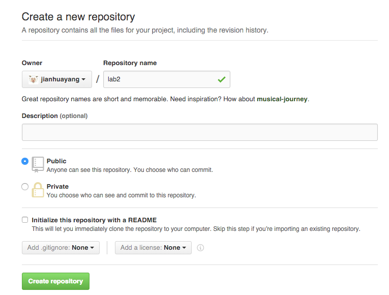
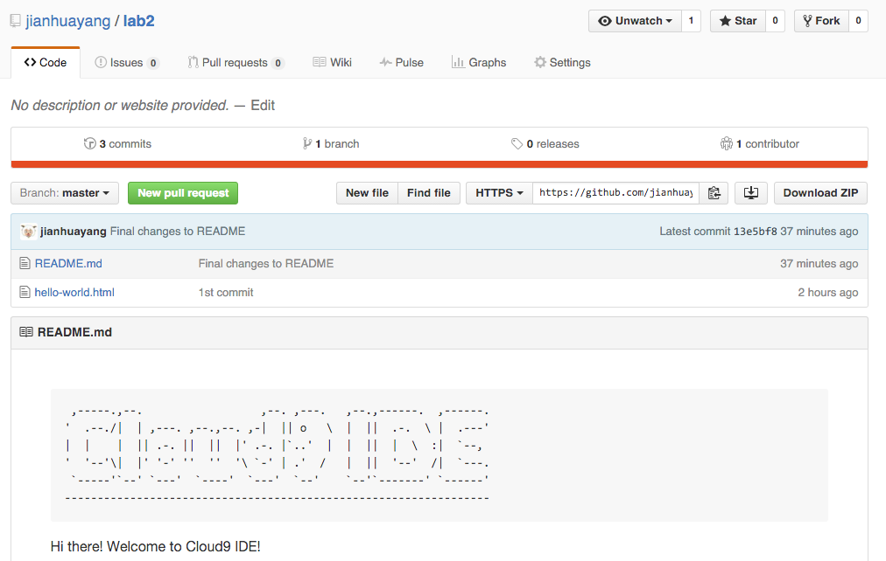
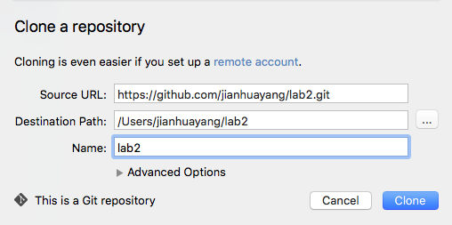
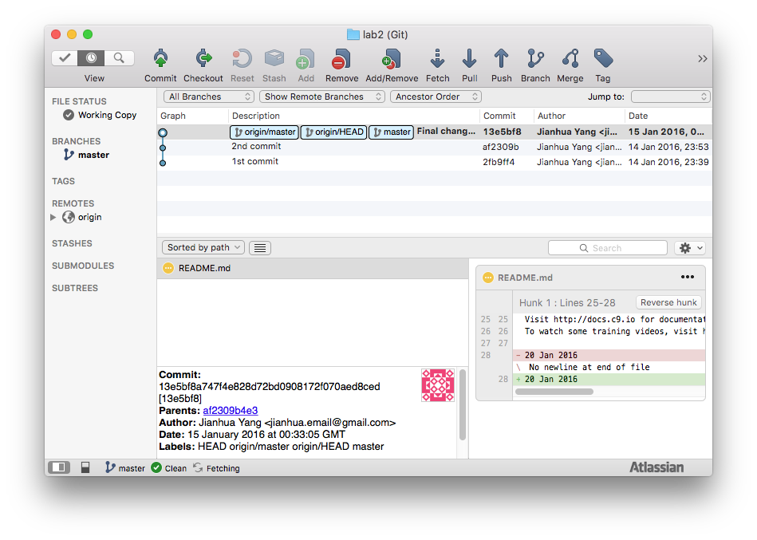

# Git

Git is a sidely-used version control system (VCS), and probably the most popular one. You need Git mainly for three reasons:

1. The source code of your website forms part of your final assessment. This needs to be submitted through GitHub, which is a website based on Git.
2. Git allows you to easier backup (and restore) your source code.
3. Git allows easier sharing and collaboration.

You'll see details of these as you go along.

> If you are old enough you've probably heard of [Google Code Search](http://web.archive.org/web/20101112131244/http://www.google.com//codesearch), which is a tool that allows programmers to search for source code. Partially due to the increased popularity of Git-base code hosting websites such as Github, this tool has now been shut down. ([code.google.com](code.google.com) is not the original site anymore.)

## Work with Git locally

In C9 create a new workspace based on HTML template and name it lab2. In terminal type in the following command and press enter. This shows you Git has been installed

```sh
    $ git
    usage: git 
    ......
    The most commonly used git commands are:
       add        Add file contents to the index
       bisect     Find by binary search the change that introduced a bug
    ......
```

> C9 Ubuntu virtual machine has Git installed by default. If you work on your own computers, make sure you download and install [Git](https://git-scm.com/downloads) first.

Here we are presented with a summary of the available Git commands.

### Initialise the repository

In terminal issue the following command to initialise a Git repository.

```sh
    $ git init
    Initialized empty Git repository in /home/ubuntu/workspace/.git/
```

A Git repository contains a hidden directory called .git which contains all the tracking data. We need to check that there is a repository. Obviously, we can't see it in the file tree (its hidden) so we need to run a command to list all the files, including the hidden ones (`ls` lists the files whilst the `ls -a` flag includes the hidden ones.

```sh
    $ ls -a
    ./  ../  .c9/  .git/  README.md*  hello-world.html
```

The first file (.) represents the current directory, the second (..) the parent directory and the last (.git) is the Git repository. So in this case, we can see that there is now a repository.

### Set user information

The first time you use the repository you should check that the name and email details are correct. These are used to indicate who has been committing code. Start by displaying the current contents of the git config file:

```
    $ git config --list
    user.name=Jianhua Yang
    user.email=(you all know it)
    ......
```

You are looking for a single entry for user.name and one for user.email. So if yours are like mine, you're fine.

There may be additional keys and values stored. If there are multiple names and/or emails you can replace all instances using the following two commands (substituting your own name and email)

```sh
    $ git config --global --replace-all user.email "johndoe@gmail.com"
    $ git config --global --replace-all user.name "John Doe"
```

> Ever wonder why it's John again, click [here](https://git-scm.com/book/en/v2/Getting-Started-First-Time-Git-Setup).

### Stage files

At any stage, you can use the `status` command to check the status of the project files. Try running this now:

```sh
    $ git status
```

You will see a message that there are untracked files. These are listed in red. Before committing files, they need to be placed in the staging area using the `add` command

> You only need to type the first few letters of the filename, press the tab key to auto-complete.

```sh
    $ git add .
```

Here `.` means the current directory.

So how can we check the file has been staged? Remember that status command?

```sh
    $ git status
```

You will see that the files have been added to the staging area to create a snapshot.

### Commit files

Once we have added one or more files to the staging area and created a snapshot we can commit the changes to our local repository. Each snapshot is accompanied by a message to explain what changes have been made. Before making the commit, it can be useful to see what changes you will be committing.

```sh
    $ git diff --cached
    diff --git a/README.md b/README.md
    new file mode 100755
    index 0000000..064ecaa
    --- /dev/null
    +++ b/README.md
    @@ -0,0 +1,26 @@
    ......
```

You'll be automatically redirected to a command line text editor. Type letter 'q' at the command prompt and hit enter to get out of it. Use your mouse to scroll up and down in the terminal window. Take a moment to make sense of the results. The three + characters next to the filename indicate that three lines have been changed. Then all the modified lines are listed. A + character at the start of the line indicates the line has been added, a - character indicates the line has been deleted. So we can see that since we haven't committed, all lines are new.

Now let's commit our changes. Remember that you need to include a descriptive message with every commit.

```sh
    $ git commit -m '1st commit'
```

This commits the changes in your staged files to the repository and removes all the files from the staged area. We can check this using the status command:

```sh
    $ git status
```

You get two important pieces of information:

1. nothing to commit (there are no changes to stage)
2. working directory clean (there are no staged files)

Let's take a look at the commit history. This lists all the commits you have made to the Git repository.

```sh
    $ git log
```

### A second commit

Return to C9 and open README.md in the editor. At the very bottom of the file add today's date

```sh
    20 Jan 2016
```

> You don't have to add the date, this is just to make some changes to the file.


Run the status command `git status` to show the current status of the repository. You should see that the README.md file is shown as modified and that no files have been staged. 

Time to stage the README.md file `git add README.md`. If you check the status again you should see the file listed as modified and staged ready for committing. Commit the staged file and add a message '2nd commit' `git commit -m '2nd commit'`.

Check the status to make sure there are no uncommitted changes and that the working directory is clean. Finally view you commit history where you should see both of the commits you have made.

### Compare files

Git creates a unique hash for each commit made to the repository. These are the long alpha-numeric strings displayed in the git log output. There is also a shorter 7 character version which can be shown when you add the abbrev-commit long flag like this:

```sh
    $ git log --abbrev-commit
```

We can use these to reference their associated commits when using the diff command which compares different commits of the same file:

```sh
    $ git diff 5a3b6f4..a07144a README.md
```

You should see all the changes made to the file between the two specified commits. '+' indicates lines added whilst '-' lines indicate lines deleted, similar to what you've seen before

### Rename files

Renaming files is easy, right? We perhaps not. Let's see what happens when we rename our file using the standard approach. Right-click on the file in the file tree and choose Rename. Call the file README2.md then run the status command:

```sh
    $ git status
```

Notice that git assumes we have deleted the old file (with all its commits) and created a new file. If we stage and commit at this stage we will lose all our commits because git thinks the file is a completely new one! 

To fix this we need to rename the file using a special git command.

Start by renaming the file back to the original name and running the status command to check there are no changes to the stage. Next we run the `git mv` command:

```sh
    $ git mv README.md README2.md
```

Now run the status command which indicates the filename has been changed.

```sh
    $ git status
    On branch master
    Changes to be committed:
      (use "git reset HEAD ..." to unstage)
    
            renamed:    README.md -> README2.md
```

Go ahead, stage and commit this file which will retain its commit history. Use the commit message 'Renamed README file'.

```
    $ git commit -am  'Renamed README file'
```

The `-a` flag ['tell the command to automatically stage files that have been modified and deleted, but new files you have not told Git about are not affected'](https://git-scm.com/docs/git-commit).

### Unstage files

Sometimes you may accidentally stage a file and wish to remove it from the staging area. Let's create a new file called notes.md using command `touch notes.md` in the terminal. Edit the file to add some text (anything you want). Modify the README2.md file as well.

Now add both files to the staging area using `git add .`. If we use status we can see one new and one modified file.

```sh
    modified:   README2.md
    new file:   notes.md 
```

Perhaps we only wanted to commit the notes file. Let's unstage the README2 file before committing.

```sh
    $ git reset HEAD README2.md
```
 
If you check the status you should see that only the notes file is staged. Commit this file with the message 'Added notes file'. If you check the status you should see that there are still uncommitted changes.

We have decided we don't want the changes we made to the README file. To undo these changes we checkout the last version we committed to the repository

```sh
    $ git checkout README2.md
```

If we examine the file we should see that the changes we made have gone. If we check the repository status we should see that there are no uncommitted changes.

### Revert to the previous commit

Let's pretend that we want to 'undo' all the changes we made since the second commit (`git log --abbrev-commit` shows `af2309b` for my 2nd commit). In other words, we want to change our working code to how it was when we made an earlier commit.

One important feature of Git is that we keep track of all changes through our commits and we can never delete any commits. So how do we revert our code whilst keeping a record of the commits we have made since that point?

In Git, all commits are made to a branch. By default, this branch is called 'master' but we can have any number of named branches, each with its own commits rather like stations on a rail network. Git uses a special flag called the `<head>` to identify where to make commits.

To revert to an old commit we need to take the following steps:

1. move/rename the current branch to reflect its new status.
2. checkout the good commit
3. create a new branch at that point called `master` and move the `<head>` flag to that branch

```sh
    $ git branch -m badcode
    $ git checkout af2309b
    $ git checkout -b master
```

You should see that the notes file has gone and the README file only contains the early edits. Let's make a change to the README file, stage and commit this as 'Final changes to README'.

```sh
    $ git commit -am 'Final changes to README'
```

Now we can display the commits and which branch they were applied to:

```sh
    $ git log --graph --all --decorate
```

You should see a detailed log with a visual representation of the branches and commits. 

For a version displaying the short commit codes try:

```sh
    $ git log --graph --abbrev-commit --decorate --date=relative --all
```

## Work with GitHub remotely

### GitHub repository

GitHub is a source code hosting website based on Git. If you haven't got one, create an account and sign in. Click on the plus sign on the top right corner and select 'New repository'. Name it lab2 and click 'Create repository'.



Once created, you'll see something similar to below


Take a note of the URL of the repository, you'll need it for later. For example, mine is `https://github.com/jianhuayang/lab2.git`

> Make sure it's https not SSH.

### Add the remote repository

To add a new remote, use the `git remote add` command on the terminal in C9, in the directory your repository is stored at.

The `git remote add` command takes two arguments:

1. A remote name, for example, `origin`
2. A remote URL, for example, `https://github.com/jianhuayang/lab2.git`

For example:

```sh
    $ git remote add origin https://github.com/jianhuayang/lab2.git
    $ git remote -v
    origin  https://github.com/jianhuayang/lab2.git (fetch)
    origin  https://github.com/jianhuayang/lab2.git (push)
```

Here the remote is called origin, which is the default name for remotes. Then finally, you want to push all your commits to your own repository located in new url.

```sh
    $ git push origin master
```

Enter the GitHub credentials as and when prompted. If you then refresh you GitHub repository you'll see the files are there now



> You can have more than one remotes, or you can remove/reset remotes. Some examples can be found [here](https://help.github.com/categories/managing-remotes/).

### Synchronize local with remote

What we have done in the previous step was to `push` our commits onto the remote GitHub server. The opposite of this operation is to `pull` (download) any commits that are on the server but not in your local repository. This can be caused two ways:

1. You have been editing (and committing) code using two different editors/computers
2. You are not the only person working on the code

First of all, let's make sure the remote is up to date

```sh
    $ git push origin master
    ......
    Everything up-to-date
```

Make some changes to README.md, and in the `git status` outputs you'll see

```sh
    modified:   README.md
```

Use the following commands to ignore local changes and restore everything to the latest commit on the remote GitHub repository

```sh
    $ git reset --hard HEAD
    $ git pull origin master
```

> There are some nice discussions on how to force Git to overwrite local files on pull on [StackOverFlow](http://stackoverflow.com/questions/1125968/force-git-to-overwrite-local-files-on-pull)

## What if Github is down?

OK, you got the idea -- there is nothing that stops you from learning (and submitting your coursework)!

GitHub will never be down! But sometimes it can happen that you cannot visit it. If that happens, use alternatives such as [GitLab](https://gitlab.com) or [Bitbucket](https://bitbucket.org/)

> It was once reported GitHub was blocked by the [Great Firewall](https://en.wikipedia.org/wiki/Great_Firewall) in China, see [here](https://en.greatfire.org/blog/2013/jan/github-blocked-china-how-it-happened-how-get-around-it-and-where-it-will-take-us).

As an alternative to web-based hosting tools, you can use offline software as well. In the following example, I show you how to clone the GitHub repository using the SourceTree software.

1. Download and install [SourceTree](https://www.sourcetreeapp.com/) if it's your own computer. On all EC machines, the software has been installed for you.
2. Select New Repository ==> Clone from URL
3. Enter you GitHub repository URL details and click Clone.
    
    
    
4. You should see now the project has been backed up to your local folder. And that you can manage Git through the GUI.
    
    
    
    In fact this C9 ==> GitHub ==> SourceTre is a better approach to backup your project rather than downloading directly from C9.


